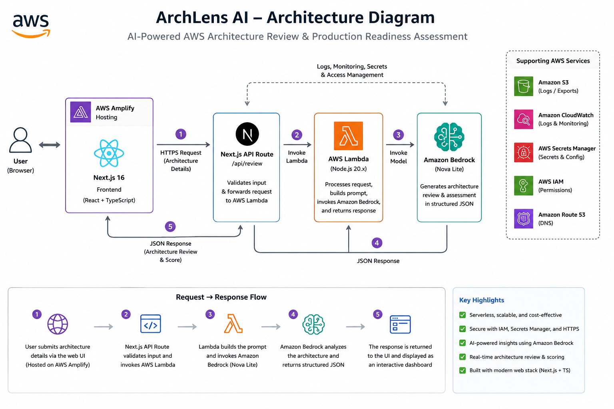
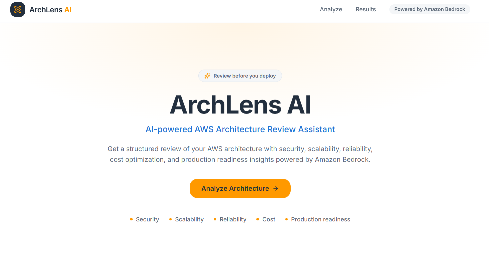
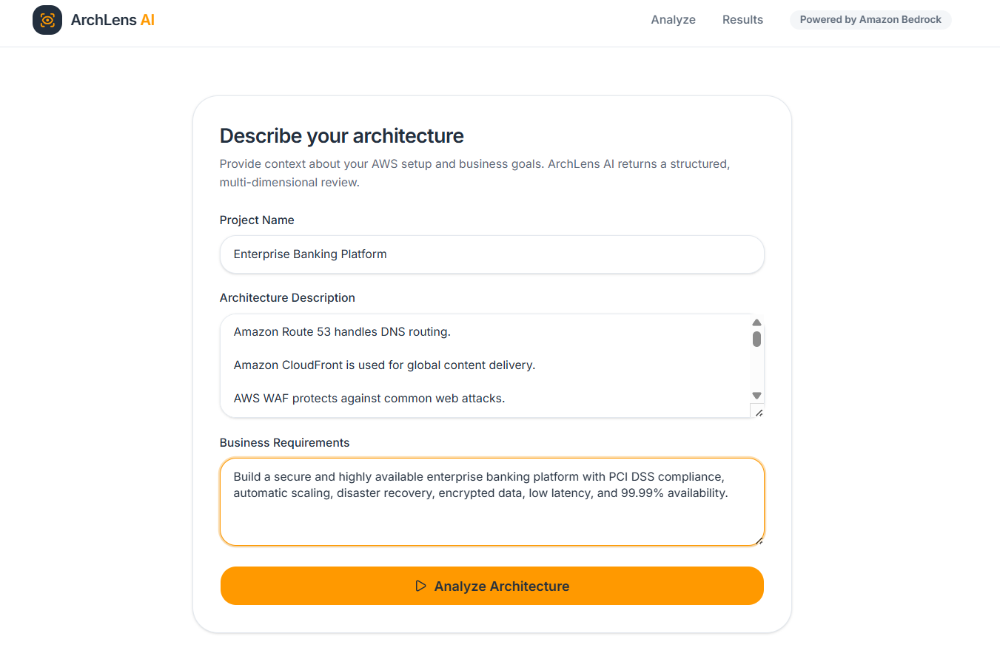
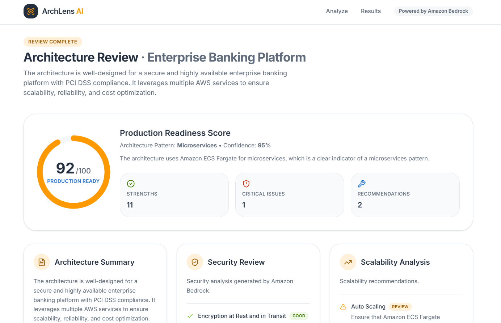
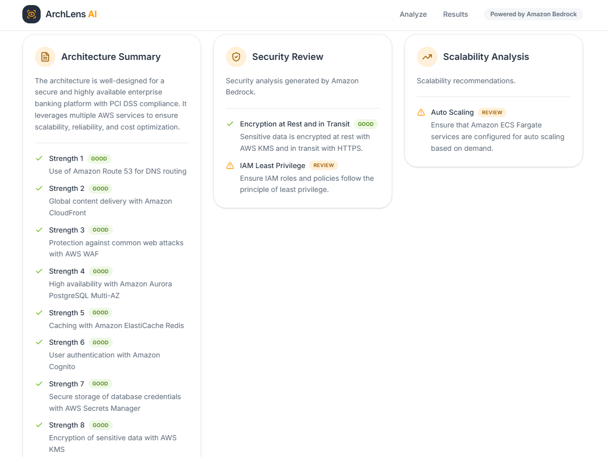
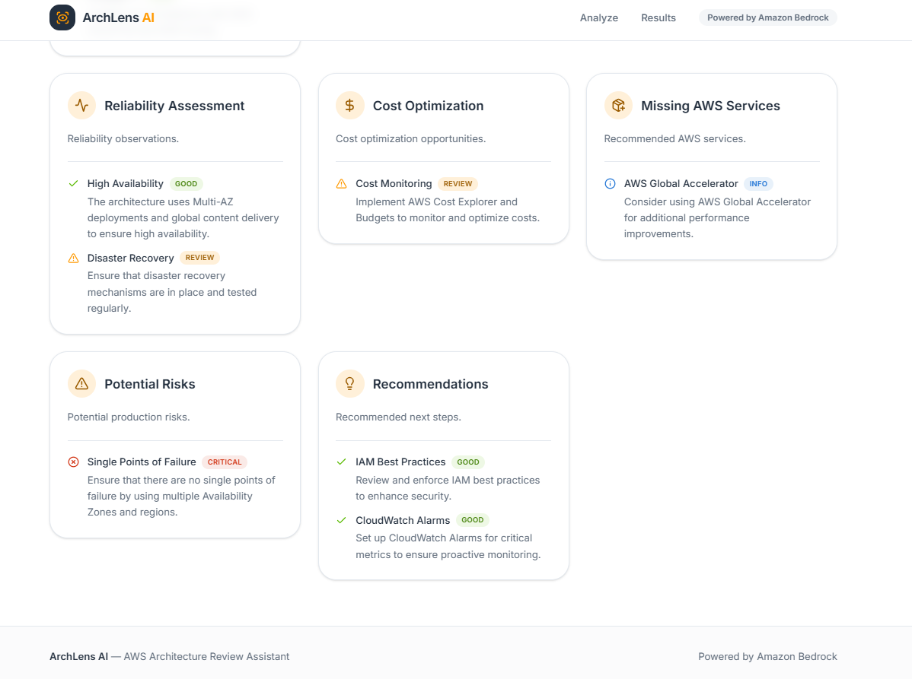

# 🚀 ArchLens AI

> **AI-powered AWS Architecture Review Assistant built with Amazon Bedrock, AWS Lambda, Next.js and AWS Amplify**

<p align="center">


</p>

---

# 📌 Project Title

# ArchLens AI

**AI-powered AWS Architecture Review & Production Readiness Assessment using Amazon Bedrock**

ArchLens AI helps developers, cloud engineers, architects, and students evaluate AWS architectures using Generative AI. Instead of manually reviewing architectures against AWS best practices, users can simply describe their AWS architecture in natural language and receive an AI-generated assessment covering production readiness, security, scalability, reliability, cost optimization, risks, and recommendations.

---

# 📖 Project Overview

Designing cloud architectures that are secure, scalable, reliable, and production-ready requires significant AWS expertise. Reviewing architectures manually is time-consuming and often inconsistent.

ArchLens AI simplifies this process by leveraging **Amazon Bedrock (Nova Lite)** to analyze AWS architectures and generate structured, production-focused reviews aligned with AWS best practices.

The application accepts:

- Project Name
- Architecture Description
- Business Requirements

and produces a comprehensive AI-generated report including:

- Production Readiness Score
- Architecture Pattern Detection
- Pattern Confidence Score
- Security Review
- Scalability Analysis
- Reliability Assessment
- Cost Optimization Suggestions
- Missing AWS Services
- Potential Production Risks
- Actionable Recommendations

The application is fully serverless and deployed on AWS.

---

# ✨ Features

## 🤖 AI-powered Architecture Analysis

Analyze AWS architectures using Amazon Bedrock.

---

## 📊 Production Readiness Score

Generates a readiness score between **0–100** based on the architecture design and best practices.

---

## 🏗 Architecture Pattern Detection

Automatically identifies architecture patterns such as:

- Serverless
- Microservices
- Event-driven
- Three-tier
- Hybrid
- AI/ML Pipeline
- Data Lake
- Container-based

---

## 🔐 Security Review

Evaluates security aspects including:

- IAM
- Encryption
- Authentication
- Authorization
- WAF
- Least Privilege
- Secrets Management

---

## 📈 Scalability Analysis

Reviews:

- Auto Scaling
- Elastic Load Balancing
- Serverless Scaling
- Database Scaling
- Traffic Handling

---

## ❤️ Reliability Assessment

Checks:

- Multi-AZ
- Disaster Recovery
- Backup Strategy
- Monitoring
- High Availability

---

## 💰 Cost Optimization

Provides recommendations for:

- Reserved Instances
- Savings Plans
- Lambda Optimization
- Storage Optimization
- Right-sizing Resources

---

## ☁ Missing AWS Services

Suggests additional AWS services that could improve the architecture.

---

## ⚠ Production Risks

Identifies:

- Single Points of Failure
- Missing Monitoring
- Missing Encryption
- Missing Backups
- Missing IAM Best Practices
- Missing Disaster Recovery

---

## 💡 Actionable Recommendations

Provides practical recommendations to improve the architecture.

---

## 📱 Modern Responsive Dashboard

- Mobile Friendly
- Tablet Friendly
- Desktop Optimized

---

# 🏗 Architecture Diagram



# 🛠 Tech Stack

## Frontend

- Next.js 16
- React
- TypeScript
- Tailwind CSS
- shadcn/ui
- Lucide Icons

---

## Backend

- Python 3.13
- AWS Lambda

---

## AI

- Amazon Bedrock
- Amazon Nova Lite

---

## Deployment

- AWS Amplify Hosting

---

## Version Control

- Git
- GitHub

---

# ☁ AWS Services Used

| AWS Service | Purpose |
|------------|---------|
| Amazon Bedrock | AI Architecture Review |
| Amazon Nova Lite | Large Language Model |
| AWS Lambda | Backend Processing |
| AWS Amplify | Hosting |
| Lambda Function URL | Public API Endpoint |
| IAM | Secure Access Control |
| CloudWatch | Logging & Monitoring |

---

# 📂 Project Structure

```
archlens-ai
│
├── app
│   ├── api
│   │   └── review
│   │       └── route.ts
│   │
│   ├── layout.tsx
│   ├── page.tsx
│   └── globals.css
│
├── components
│   ├── analysis-form.tsx
│   ├── result-card.tsx
│   ├── results-section.tsx
│   ├── score-ring.tsx
│   ├── hero.tsx
│   └── site-header.tsx
│
├── lambda
│   ├── lambda_function.py
│   ├── prompt.py
│   ├── validator.py
│   ├── schema.py
│   └── requirements.txt
│
├── lib
│   ├── types.ts
│   └── utils.ts
│
├── public
│
├── package.json
├── next.config.mjs
└── README.md
```

---

# 🚀 Live Demo

### 🌐 Application

https://main.d10fh3nwxvv1tf.amplifyapp.com/

---

# 🖼️ Screenshots

## Home Page



---

## Input Form



---

## Production Readiness Score



---

## Recommendations






---

# ⚙️ Local Setup

## Clone Repository

```bash
git clone https://github.com/Muddu397/archlens-ai.git
```

Move into project

```bash
cd archlens-ai
```

Install dependencies

```bash
pnpm install
```

Create

```
.env.local
```

Example

```env
LAMBDA_URL=https://YOUR-LAMBDA-URL
```

Run

```bash
pnpm dev
```

Production Build

```bash
pnpm build
```

---

# 📊 Sample Output

```json
{
  "production_readiness_score": 92,
  "architecture_pattern": {
    "name": "Serverless Microservices",
    "confidence": 95
  },
  "strengths": [
    "High availability",
    "Secure authentication",
    "Auto Scaling"
  ]
}
```

---

# 🔮 Future Improvements

- Upload Architecture Diagram
- Drag & Drop Support
- CloudFormation Analysis
- Terraform Analysis
- AWS Well-Architected Pillar Score
- Cost Estimation
- PDF Report Export
- Multi-cloud Architecture Support
- Architecture Comparison
- Architecture History
- Amazon Bedrock Knowledge Base Integration
- Amazon Q Integration

---

# 👨‍💻 Author

## Mohammed Mudasser

AI/ML Engineer | AWS Certified | Generative AI | Machine Learning

### GitHub

https://github.com/Muddu397

### LinkedIn

https://www.linkedin.com/in/mohammed-mudasser

---

# 🙌 Acknowledgements

This project was built using:

- Amazon Bedrock
- Amazon Nova Lite
- AWS Lambda
- AWS Amplify
- Next.js
- TypeScript
- Tailwind CSS
- shadcn/ui

Special thanks to the AWS community for the documentation, tutorials, and best practices that helped shape this project.

---

# 📜 License

This project is licensed under the MIT License.

Feel free to use, modify, and distribute this project under the terms of the MIT License.

---

# ⭐ Support

If you found this project useful,

⭐ Star this repository

🍴 Fork the repository

🛠 Contribute improvements

📢 Share it with the AWS community

Your support helps improve the project and encourages future development.
